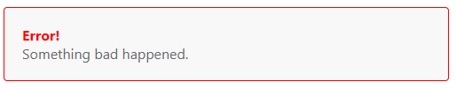

# 组件基础

每当你使用一个组件，就创建了一个新的实例。

`defineProps` 是一个仅 `<script setup>` 中可用的编译宏命令，并不需要显式地导入。声明的 `props` 会自动暴露给模板。`defineProps` 会返回一个对象，其中包含了可以传递给组件的所有 props：

```vue
<!-- BlogPost.vue -->
<script setup>
const props = defineProps(["title"]);
console.log(props.title);
</script>

<template>
  <h4>{{ title }}</h4>
</template>
```

通过 defineEmits 宏来声明需要抛出的事件：

```vue
<!-- BlogPost.vue -->
<script setup>
const emit = defineEmits(["enlarge-text"]);
emit("enlarge-text");
</script>
```

## 通过插槽来分配内容

通过 Vue 的自定义 `<slot>` 元素来实现：

```vue
// App.vue

<script setup>
import AlertBox from "./AlertBox.vue";
</script>

<template>
  <AlertBox> Something bad happened. </AlertBox>
</template>
```

```vue
// AlertBox.vue

<template>
  <div class="alert-box">
    <strong>Error!</strong>
    <br />
    <slot />
  </div>
</template>

<style scoped>
.alert-box {
  color: #666;
  border: 1px solid red;
  border-radius: 4px;
  padding: 20px;
  background-color: #f8f8f8;
}

strong {
  color: red;
}
</style>
```



## 动态组件

有些场景会需要在两个组件间来回切换，比如 Tab 界面：

```vue
<!-- currentTab 改变时组件也改变 -->
<component :is="tabs[currentTab]"></component>
```

当使用 `<component :is="...">` 来在多个组件间作切换时，被切换掉的组件会被卸载。我们可以通过 `<KeepAlive>` 组件强制被切换掉的组件仍然保持“存活”的状态。

## DOM 模板解析注意事项

HTML 标签和属性名称是不分大小写的，所以浏览器会把任何大写的字符解释为小写。这意味着当你使用 DOM 内的模板时，无论是 `PascalCase` 形式的组件名称、`camelCase` 形式的 prop 名称还是 `v-on` 的事件名称，都需要转换为相应等价的 `kebab-case` (短横线连字符) 形式：

```js
// JavaScript 中的 camelCase
const BlogPost = {
  props: ['postTitle'],
  emits: ['updatePost'],
  template: `
    <h3>{{ postTitle }}</h3>
  `
}
```

```html
<!-- HTML 中的 kebab-case -->
<blog-post post-title="hello!" @update-post="onUpdatePost"></blog-post>
```