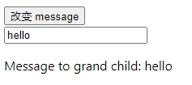
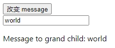

# 依赖注入

## Prop 逐级透传问题

通常情况下，当我们需要从父组件向子组件传递数据时，会使用 props。有一些多层级嵌套的组件，形成了一颗巨大的组件树，而某个深层的子组件需要一个较远的祖先组件中的部分数据。在这种情况下，如果仅使用 props 则必须将其沿着组件链逐级传递下去，这会非常麻烦。可能中间层级组件并不关心这些 props，但为了能让下级组件使用，必须将其逐级透传下去。

`provide` 和 `inject` 可以帮助我们解决这一问题。一个父组件相对于其所有的后代组件，会作为依赖提供者。任何后代的组件树，无论层级有多深，都可以注入由父组件提供给整条链路的依赖。

## 1. provide（提供）

要为组件后代提供数据，需要使用到 `provide()` 函数：

```vue
<script setup>
import { provide } from 'vue'

provide(/* 注入名 */ 'message', /* 值 */ 'hello!')
</script>
```

`provide()` 函数接收两个参数。第一个参数被称为注入名，可以是一个字符串或是一个 Symbol。后代组件会用注入名来查找期望注入的值。一个组件可以多次调用 `provide()`，使用不同的注入名，注入不同的依赖值。

第二个参数是提供的值，值可以是任意类型，包括响应式的状态，比如一个 ref：

```js
import { ref, provide } from 'vue'

const count = ref(0)
provide('key', count)
```

提供的响应式状态使后代组件可以由此和提供者建立响应式的联系。

## 2. inject（注入）

要注入上层组件提供的数据，需使用 `inject()` 函数：

```vue
<script setup>
import { inject } from 'vue';

const message = inject('message')
</script>
```

如果提供的值是一个 ref，注入进来的会是该 ref 对象，而不会自动解包为其内部的值。这使得注入方组件能够通过 ref 对象保持了和供给方的响应性链接。

```vue
// app.vue

<script setup>
  import { ref, provide } from 'vue'
  import Child from './Child.vue'

  const message = ref('hello')
  provide('message', message);

  function onChange() {
    message.value = "world";
  }
</script>

<template>
  <button @click="onChange">改变 message</button>
  <br />
  <input v-model="message">
  <Child />
</template>
```

```vue
// Child.vue
<script setup>
  import GrandChild from './GrandChild.vue';
</script>

<template>
  <GrandChild />
</template>
```

```vue
// GrandChild.vue

<script setup>
  import { inject } from 'vue';

  const message = inject('message');
</script>

<template>
  <p>Message to grand child: {{ message }}</p>
</template>
```



点击 `改变 message` 按钮后，GrandChild 组件中的 message 会自动更新。


